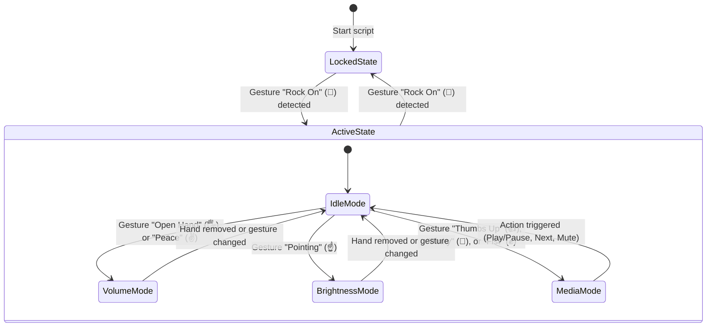

# Smart Hand Gesture Controller

A real-time, webcam-based system controller that leverages computer vision to track hand gestures, enabling touchless control over system volume, screen brightness, and media actions (Play/Pause, Next Track, Mute) on Windows.

---

## 🚀 Key Features

* **Futuristic HUD Overlay**: Glassmorphism dashboard panels drawn directly on the camera frame, featuring active mode tags, gesture names, and smooth vertical levels indicators.
* **Anti-Trigger Activation Guard**: Prevent unintended settings changes. Toggles lock state between **LOCKED** (red indicators) and **ACTIVE** (green indicators) using the "Rock On" (🤘) gesture.
* **Dual Analog Controls**:
  * **Volume Pinch**: Distance interpolation between thumb tip (landmark 4) and index tip (landmark 8) modifies Windows master volume.
  * **Brightness Slider**: Vertical coordinate tracking of pointing finger (landmark 8) adjusts screen brightness with a 3% change buffer for lag reduction.
* **Discrete Media Shortcuts**:
  * **Thumbs Up (👍)** → Play / Pause
  * **Pinky (🤙)** → Next Track
  * **Fist (✊)** → Mute System Toggle
* **HUD Notifications**: Dynamic popup overlays appear on screen when media shortcuts or lock toggles are triggered.

---

## ⚙️ Control State Machine



---

## 🛠️ Tech Stack & Requirements

* **Core Language**: Python 3.9+
* **Computer Vision**: OpenCV, MediaPipe Hands
* **System Integration**: Pycaw (audio master controller), Screen-Brightness-Control, PyAutoGUI (virtual media keystrokes)

---

## 📂 Project Structure

```text
gesture/
├── main.py             # Main camera capture & gesture processing loop
├── requirements.txt    # Dependency specifications
├── README.md           # Recruiter-ready documentation
└── linkedin_post.md    # Promotional social media draft
```

---

## 🚀 Setup & Execution

Follow these steps to run the Gesture Controller locally on Windows:

### 1. Prerequisites
* Python 3.9+
* Built-in or external USB webcam

### 2. Installation
1. Open a command prompt and navigate to the project directory:
   ```cmd
   cd C:\Users\gurle\OneDrive\Desktop\gesture
   ```
2. Create and activate a Python virtual environment:
   ```cmd
   python -m venv venv
   venv\Scripts\activate
   ```
3. Install dependencies:
   ```cmd
   pip install -r requirements.txt
   ```

### 3. Run the Application
Start the gesture controller loop:
```cmd
python main.py
```
* **To quit**: Click the camera window and press **`Q`**.
